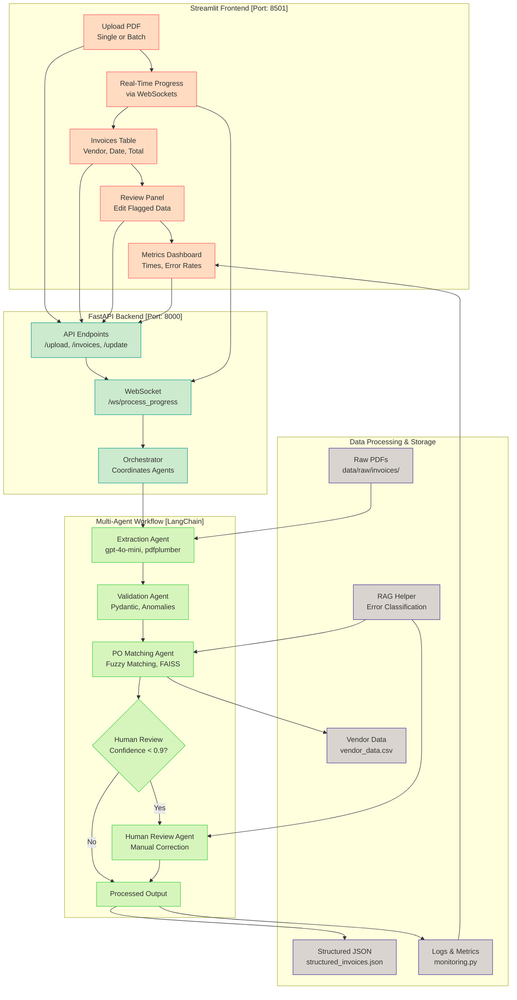

# 📊 Brim Invoice Processing System

<div align="center">

[](https://www.python.org/downloads/)
[](https://fastapi.tiangolo.com/)
[](https://streamlit.io/)
[](https://langchain.io/)
[](https://openai.com/)

*An intelligent invoice processing system leveraging LangChain's multi-agent workflow*

[Overview](#-overview) •
[Features](#-key-features) •
[Development Journey](#-development-journey) •
[Architecture](#-architecture) •
[Setup Guide](#-setup-guide) •
[Usage](#-usage-guide) •
[Progress](#-project-progress)

</div>

## 🎯 Overview

A sophisticated invoice processing system that leverages LangChain's multi-agent workflow to automate extraction, validation, and purchase order (PO) matching. Built as a technical challenge for Brim's Agentic AI Engineer position, this solution aims to reduce manual processing time by over 75% while maintaining high accuracy through intelligent error handling and human-in-the-loop review processes.

## 📋 Key Features

- **Intelligent Processing Pipeline**
  - Processes PDFs from:
    - `data/raw/invoices/` (35 invoices)
  - Multi-agent system for extraction, validation, and matching
  - RAG-based error handling with FAISS `data/raw/test_samples/` -> (5 faulty PDFs examples to reduce the need for human review)
  - Asynchronous processing with robust error management

- **User-Friendly Interface**
  - Streamlit-powered dashboard
  - Real-time processing updates
  - Interactive invoice review system
  - Performance metrics visualization (one problem encountered and not solved mentioned below)

- **Enterprise-Ready Architecture**
  - FastAPI backend infrastructure
  - Structured logging and monitoring
  - Comprehensive test coverage (CI/CD)
  - Deployment-ready configuration
  - Dockerized and with images ready in DockerHub

## 🏗️ Architecture

### Project Structure

```plaintext
brim_invoice_streamlit/
├── Dockerfile
├── docker-compose.yml
├── main.py
├── README.md
├── requirements.txt
├── .gitignore
├── agents/
│   ├── __init__.py
│   ├── base_agent.py
│   ├── extractor_agent.py
│   ├── fallback_agent.py
│   ├── human_review_agent.py
│   ├── matching_agent.py
│   └── validator_agent.py
├── api/
│   ├── __init__.py
│   ├── app.py
│   └── review_api.py
├── config/
│   ├── __init__.py
│   ├── logging_config.py
│   ├── monitoring.py
│   ├── settings.py
│   
├── data/
│   ├── processed/
│   │   └── anomalies.json
│   │   └── structured_invoices.json
│   ├── raw/
│   │   └── invoices/ *pdfs
│   │   └── vendor_data.csv
│   ├── temp/
│   │   └── … (temporary files)
│   └── test_samples/
│       └── … (sample faulty invoices for rag_helper.py)
├── data_processing/
│   ├── __init__.py
│   ├── anomaly_detection.py
│   ├── confidence_scoring.py
│   ├── document_parser.py
│   ├── ocr_helper.py
│   ├── po_matcher.py
│   ├── rag_helper.py
│       
├── frontend/
│   └── app.py
├── models/
│   ├── __init__.py
│   ├── invoice.py
│   ├── validation_schema.py
│   
└── workflows/
    ├── __init__.py
    ├── orchestrator.py
    

```

### Architecture Diagram (both project variants; different reps)

```plaintext
+-------------------+       +-------------------+
|   Streamlit UI    |       |    Next.js UI     |
| (Python-based)    |       | (Production-ready)|
| - Streamlit       |       | - React, Next.js  |
|   Dashboard       |       | - Tailwind CSS    |
+-------------------+       +-------------------+
           |                         |
           +-----------+-------------+
                       |
                +------+------+
                | FastAPI     |
                | Backend     |
                | - WebSocket |
                |   Support   |
                +------+------+
                       |
           +-----------+-------------+
           |                         |
+-------------------+       +-------------------+
|   Extraction      |       |   Validation      |
|   Agent           |       |   Agent           |
| - gpt-4o-mini     |       | - Pydantic Models |
| - pdfplumber      |       |                   |
| - pytesseract     |       +-------------------+
+-------------------+                |
           |                         |
           +-----------+-------------+
                       |
                +------+------+
                | PO Matching |
                |    Agent    |
                | - Fuzzy      |
                |   Matching   |
                +------+------+
                       |
                +------+------+
                | Human Review|
                |    Agent    |
                | - Confidence|
                |   < 0.9     |
                +------+------+
                       |
                +------+------+
                | Fallback    |
                |    Agent    |
                | - FAISS RAG  |
                +------+------+
                       |
                +------+------+
                | Data Storage|
                | - structured|
                |   _invoices |
                | - anomalies  |
                +------+------+
```



## 📅 Development Journey

### Week 1: Core Development

#### Day 1: Project Foundation

- 🎯 **Objectives Achieved**
  - Created detailed 10-day roadmap
  - Analyzed technical requirements
  - Established project structure
  
- 🔧 **Technical Setup**
  - Initialized repository
  - Installed core dependencies:
    - LangChain (0.2.16)
    - PDF processing tools
    - OCR capabilities
    - others..

  - Reserved AI tools:
    - GPT-o3-mini
    - Claude 3.5 Sonnet / 3.7 Sonnet Thinking
    - GitHub Copilot
    - Grok3

#### Day 2: Extraction & Validation

- 🎯 **Objectives Achieved**
  - Built extraction pipeline
  - Implemented validation system
  
- 🛠️ **Components Developed**
  1. **PDF Processing Pipeline**
     - Document parsing with pdfplumber
     - OCR processing with pytesseract
     - Data model implementation
  
  2. **Extraction Agent**
     - LangChain 0.2.16 integration
     - Mistral 7B implementation
     - JSON output formatting
  
  3. **Validation System**
     - Field validation
     - Anomaly detection
     - Format consistency checks

#### Day 3: Advanced Features

- 🎯 **Objectives Achieved**
  - Enhanced error handling
  - Improved extraction accuracy
  
- 🔨 **Technical Implementation**
  - Integrated FAISS-based RAG
  - Added performance monitoring
  - Implemented fallback mechanisms
  - Enhanced logging system

#### Day 4: System Integration

- 🎯 **Objectives Achieved**
  - Completed core functionality
  - Implemented frontend
  
- 🛠️ **Features Added**
  - PO matching system
  - Human review interface
  - Processing pipeline
  - Streamlit dashboard

#### Day 5: System Refinement

- 🎯 **Objectives Achieved**
  - Fixed critical issues
  - Enhanced reliability
  - Achieved fully functional state
  
- 🔧 **Technical Fixes**
  1. **Pipeline Timing**
     - Issue: Inaccurate processing times
     - Solution: Enhanced monitoring system
  
  2. **Confidence Scoring**
     - Issue: Incorrect confidence calculations
     - Solution: Improved scoring algorithm
  
  3. **File Management**
     - Issue: PDF handling inefficiencies
     - Solution: Optimized storage system
  
  4. **Data Formatting**
     - Issue: Inconsistent data formats
     - Solution: Standardized processing

#### Day 6: More Project Refinement and Stabilization

- 🎯 **Objectives Achieved**
  - Streamlined codebase by removing redundant files
  - Fixed backend startup issues
  - Enhanced API reliability
  
- 🔧 **Technical Improvements**
  1. **Backend Optimization**
     - Merged review functionality into unified API
     - Updated uvicorn startup configuration
     - Simplified routing structure
  
  2. **Code Cleanup**
     - Removed redundant `api/human_review_api.py`
     - Consolidated workflow logic in `orchestrator.py`
     - Updated all API references to use port 8000

- 🎯 **Dockerization Complete**
  - Fully Dockerized the Streamlit version with a multi-service setup (FastAPI backend and Streamlit frontend)
  - Utilized a single `Dockerfile` for both services, orchestrated with `docker-compose.yml`
  - Fixed healthcheck issue by adding `curl` to the `Dockerfile` for the `/api/invoices` endpoint check
  - Confirmed all core features (single/batch invoice processing, review, metrics) work in the Dockerized environment
  
- 🔧 **Technical Implementation**
  - Created `Dockerfile` with `python:3.12-slim`, `tesseract-ocr`, and `curl`
  - Set up `docker-compose.yml` with separate `backend` and `streamlit` services
  - Added healthcheck with 30s `start_period` to ensure backend readiness
  - Successfully tested all functionalities in a containerized setup

- 🚨 **Problems Encountered**
  - The 'View PDF' button may return 404 errors for batch-processed invoices due to filename mismatches in `data/raw/invoices/`
  - Status: Workaround implemented using metadata from JSON files

#### Day 7: Comprehensive Testing & Documentation Refinement

- 🎯 **Objectives Achieved**
  - Comprehensive manual tests
  - CI/CDing
  - Refinement of documentations
  - Creation of demo video

## 🔧 Setup Guide (Dockerized)

### Prerequisites

- Docker
- Docker Compose
- Git
- OpenAI API key
- Sample data files

### Setup Guide (Dockerized)

1. **Clone the repository**:

   ```bash
   git clone https://github.com/yourusername/brim_invoice_streamlit.git
   cd brim_invoice_streamlit
   ```

2. **Create Environment File**

   ```bash
   echo "OPENAI_API_KEY=your_api_key_here" > .env
   ```

3. **Verify Sample Data**
   - Confirm presence of:
   - PDFs in `data/raw/invoices/` (e.g., sample invoices)
   - Test files in `data/raw/test_samples/` (e.g., faulty invoices for RAG)
   - `data/raw/vendor_data.csv`
   - If missing, add sample PDFs and CSV as needed.

4. **Build and Run**

   ```bash
   docker compose up --build -d
   ```

   Note: curl is required in the container for the healthcheck to function.

5. **System Access**
   - Frontend: <http://localhost:8501>
   - API Endpoint: <http://localhost:8000>

6. **Optional: Use pre-built Docker images:**

Pull the images from Docker Hub:

```bash
docker pull yancotta/brim_invoice_streamlit_backend:latest
docker pull yancotta/brim_invoice_streamlit_streamlit:latest
```

Edit docker-compose.yml to use these images instead of building locally (replace the build sections with image: yancotta/brim_invoice_streamlit_backend:latest, etc.).

## 🚀 Usage Guide

### Processing Logic

- **Duplicate Detection**: Automatic flagging by invoice_number
- **Confidence Thresholds**: ≥0.9 for auto-processing, <0.9 requires human review
- **Processing Mode**: Asynchronous execution
- **Data Persistence**: Full metrics and logging

### Core Workflows

1. **Invoice Processing**
   - Upload PDFs through Streamlit interface
   - Monitor processing status
   - View extraction results

2. **Results Management**
   - View processed invoices
   - Review flagged items
   - Track performance metrics

3. **Review Process**
   - Edit flagged invoices
   - Submit corrections
   - Verify changes

## 📈 Project Progress

### Completed (Days 1-7)

- ✅ Multi-agent system implementation
- ✅ Streamlit frontend development
- ✅ OpenAI API integration
- ✅ RAG-based error handling
- ✅ System optimizations
- ✅ Backend stabilization and cleanup
- ✅ Final stabilization and frontend improvements
- ✅ Dockerized and implemented CI/CD
- ✅ Finished documentation and testing

## 🔮 Future Enhancement: Database-Backed Invoice Management

### Context

The current Streamlit system uses a file-based approach (`data/raw/invoices/`) for simplicity within the 10-day challenge. However, with 5,000 monthly invoices, a scalable database solution was considered to improve manageability and usability.

### Proposed Solution

#### Architecture Components

1. **Database Layer**
   - PostgreSQL for structured metadata storage
     - Invoice numbers, vendors, dates, totals
     - Processing status and validation results
     - File references and timestamps
   - Alternative: MongoDB for flexible document storage

2. **Object Storage**
   - AWS S3 or local file server for PDF storage
   - Secure, scalable document management
   - Built-in versioning and backup capabilities

#### Implementation Steps

1. **Database Setup** (2 days)

```sql
CREATE TABLE invoices (
    id SERIAL PRIMARY KEY,
    invoice_number VARCHAR(50) UNIQUE,
    vendor_name VARCHAR(100),
    issue_date DATE,
    total_amount DECIMAL(10,2),
    status VARCHAR(20),
    confidence_score FLOAT,
    pdf_url VARCHAR(255),
    created_at TIMESTAMP DEFAULT CURRENT_TIMESTAMP
);
```

2. **Storage Configuration** (1 day)
- S3 bucket setup with appropriate permissions
- Folder structure for invoice PDFs
- Backup and retention policies

3. **Application Updates** (1-2 days)
   - Modify `app.py` for database operations
   - Implement PDF storage and retrieval
   - Update processing pipeline for new architecture

4. **Frontend Enhancements**
   - Add advanced search capabilities
   - Implement filtering and sorting
   - Enable bulk operations
   - Improve PDF preview and download

### Benefits

- 📈 Scalability for thousands of invoices
- 🔍 Enhanced search and filtering
- 🔒 Improved security and access control
- 📊 Better reporting capabilities
- 🔄 Reliable backup and recovery

### Why Not Implemented

Time constraints within the 10-day challenge prioritized delivering a functional system. The modular design allows future database integration without significant refactoring.

### Implementation Roadmap

1. **Phase 1**: Database Integration
   - Set up PostgreSQL
   - Migrate existing data
   - Update core processing logic

2. **Phase 2**: Storage Migration
   - Configure S3 storage
   - Move PDFs to new storage
   - Update file handling logic

3. **Phase 3**: Frontend Enhancement
   - Add database-driven features
   - Implement advanced search
   - Enhance user experience

Estimated Timeline: 4-5 days for full implementation

### Known Issue: Processing Times Displaying as 0.00 Seconds

**Problem Encountered**: During testing on February 25, 2025, I noticed that all processing times (extraction, validation, matching, review, and total time) displayed as 0.00 seconds on both the Invoices and Metrics pages of the Streamlit frontend. This persisted across multiple invoices, despite other functionalities—such as invoice extraction, validation, matching, review, and confidence scoring—working correctly.

**Troubleshooting Efforts**: I investigated the timing capture logic in `workflows/orchestrator.py` and `config/monitoring.py`. Initially, the `Monitoring.timer` context manager yielded no value, causing timing variables (e.g., `extraction_time`) to remain `None` and default to 0.0. I introduced a `TimerContext` class to capture durations via `__exit__`, and updated `process_invoice` to use `timer.duration`. However, this didn’t resolve the issue because the assignments were incorrectly placed inside the `with` blocks, capturing `0.0` before the duration was set.

A subsequent fix moved these assignments outside the `with` blocks to capture the actual durations post-execution. While this approach was sound in theory, applying it inadvertently broke the system due to an indentation error: the `process_invoice` method was not properly nested under the `InvoiceProcessingWorkflow` class. This led to `AttributeError` exceptions when the backend attempted to call `workflow.process_invoice`, resulting in 500 Internal Server Errors and a non-functional system.

**Current Status**: Despite multiple attempts to correct the timing capture—including verifying the `TimerContext` implementation and adjusting indentation—the system ceased functioning after the latest fix. Logs indicate successful agent initialization and test sample processing, but the frontend reports "Failed to connect to the server," and invoice uploads fail. Due to time constraints within the 10-day technical challenge, I’ve decided to revert to the previous working version, where all core functionalities operate correctly except for the timing metrics.

**Resolution**: For now, the processing times remain broken, displaying 0.00 seconds. This does not impact the system’s primary invoice processing capabilities, but it limits performance monitoring accuracy. A future fix would involve correctly indenting the `process_invoice` method under the class, ensuring atomic file writes to prevent JSON corruption (noted in logs as "JSON decode error"), and re-testing the timing capture logic. Given the project timeline, I’ve prioritized a fully functional system over perfecting this metric.

**Next Steps**: Post-submission, I’d address this by isolating the timing logic in a separate test harness, ensuring proper class method scoping, and implementing robust file handling to avoid concurrency issues.

### Remaining Tasks

#### Day 7-10

- Refine Documentation and Video Demo
- Delivery

---

<div align="center">

**Built with ❤️ for Brim's Technical Challenge**

</div>
